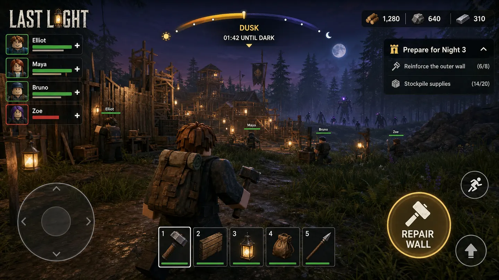
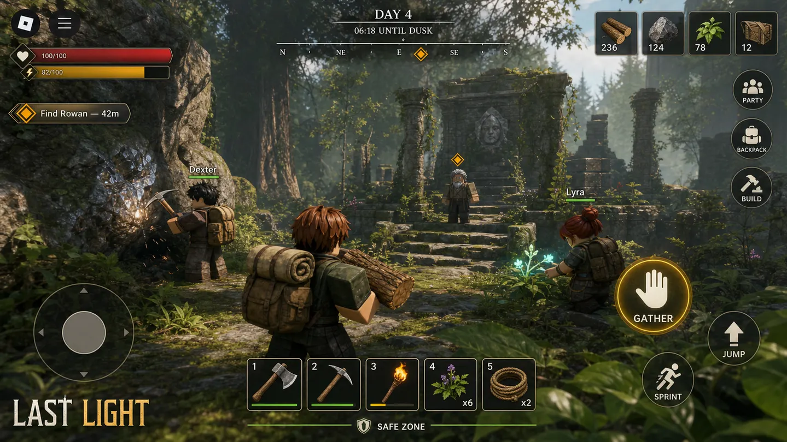
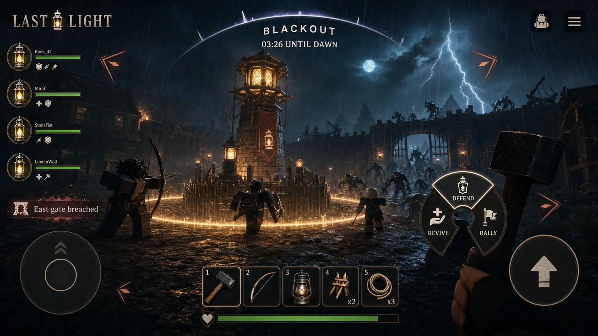
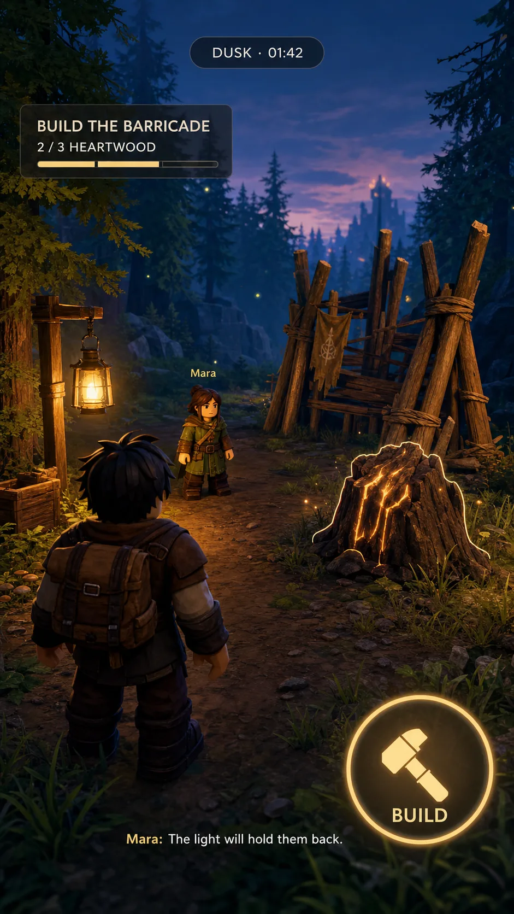
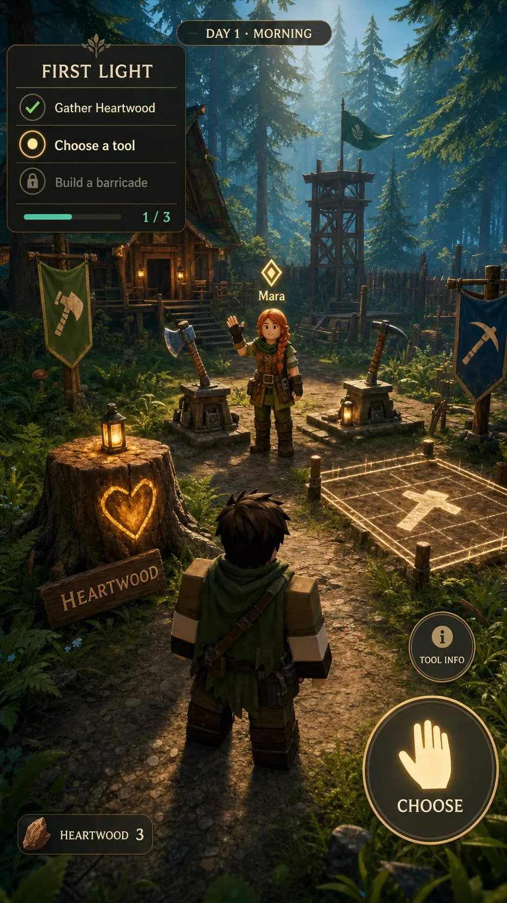
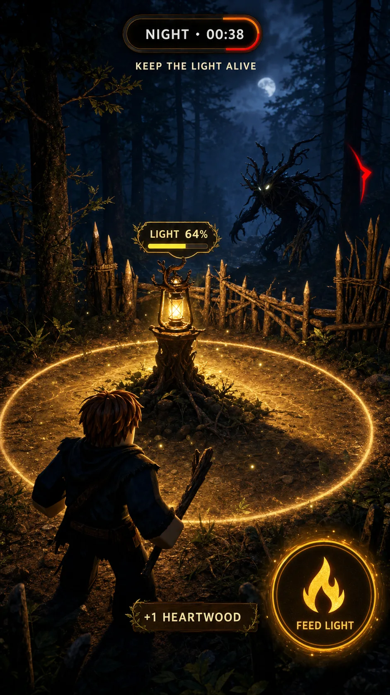

# UI design direction

## Durable research snapshot

This file preserves the actionable results of the Last Light mobile gameplay-HUD
research generated on 2026-07-25 PDT (2026-07-26 UTC). The
[hosted report](https://www.lazyweb.com/report/lazyweb/a5059523-0d43-4386-b0f5-bda12ca3d7ea/?source=create)
contains the full source exploration; this committed snapshot remains usable if
that external page changes or disappears.

The focused
[First-Ten-Minutes mobile HUD report](https://www.lazyweb.com/report/lazyweb/a34ce67d-041e-434b-acb6-0afd4ccf7ef4/?source=create)
refines that broad system for rescue, gathering, tool choice, building, and the
first two-minute night. Its evidence was directional: 9 selected mobile
references from 77 deduplicated results, with three lower-coverage
function-level searches called out in the hosted report.

The
[Co-op Rescue HUD report](https://www.lazyweb.com/report/lazyweb/01fb79d9-741c-4685-8786-831be744e372/?source=create)
grounds the player-survival increment. Its exact real-time co-op coverage was
limited, so it was used for hierarchy and occlusion guidance rather than copied
as a genre convention.

The
[Mobile Combat Stamina + Dodge report](https://www.lazyweb.com/report/lazyweb/4e46b6e2-7bef-4633-a7b5-ed7a872da2e8/?source=create)
grounds the combat-mobility layer. Its genre coverage was also directional, so
the implementation applies its hierarchy guidance to Last Light's existing HUD:
one contextual stamina rail, one large dodge action, and one targeted attack
warning backed by a world-space impact zone.

The
[Warden Stag Mobile Boss Layer report](https://www.lazyweb.com/report/lazyweb/d5a79e5a-8f10-46e0-b0ed-8e6e09b2dccb/?source=create)
grounds the first chapter-boss layer. The quick-search corpus had weak exact
raid-HUD coverage, so its adjacent event-progress examples are not treated as
direct genre evidence. The screenshot-grounded report is applied as one
contextual boss rail with exact phase/health, root progress, explicit
preserve-versus-break consequence language, and the existing higher-priority
targeted attack card.

The
[Bramblewake Mobile Blackout Event Layer report](https://www.lazyweb.com/report/lazyweb/558b7278-8455-4639-bf62-bd4ebb97a034/?source=create)
grounds the first chapter event shell. Its source coverage was strongest for
adjacent mobile live-event and countdown patterns rather than an exact Roblox
Blackout match, so the implementation uses the hierarchy without copying a
specific visual: a separate compact clock/stage rail sits above the existing
elite, boss, ally, and targeted-threat layers.

## Chosen system

The default is a **context-sensitive survival HUD**:

- show phase/time, health/stamina, hotbar, urgent squad state, and one dominant
  current action;
- reveal objective, resource, defense, companion, and status information only
  when it becomes relevant;
- keep safe-town play calm and visually sparse;
- use icon plus text or shape plus color for every critical state;
- never cover Roblox's menu area, touch thumb zones, threats, or the current
  interaction target;
- collapse rapid pickups and repeated alerts instead of stacking clutter.

The **compact corner HUD** is the stable low-effects/accessibility alternative.
The **living-world HUD** is an event layer reserved for Blackouts, bosses, and
major breaches; it must always retain explicit text/icon backups.

For the first session, the chosen composition is **One Active Trail**:

- one phase/time capsule;
- one active objective with honest step progress;
- one input-aware contextual action in the safe thumb zone;
- compact dialogue and resource feedback only when relevant;
- the same hierarchy transformed, not replaced, when night becomes urgent.

For player rescue, the same system becomes:

- one full-width bottom rail for the downed player, above action controls;
- one compact top-center alert for the active player's most urgent ally;
- one in-world outlined target and existing contextual action for the precise
  revive interaction;
- text, countdown, direction, distance, and shape in addition to color;
- no modal, store prompt, or separate tiny help button during the timed state.

For combat mobility, the same system becomes:

- stamina visible during combat, spending, recovery, or cooldown rather than as
  permanent safe-town clutter;
- one text-labeled dodge action with ready, low, cooldown, and active states;
- one targeted attack alert only while the server telegraph is active;
- a locked world zone plus explicit attack name, dodge instruction, and time;
- no color-only warning or expanded multi-slot action bar.

## Visual targets

### Default context-sensitive survival HUD

### Compact low-effects and accessibility fallback

### Blackout and boss event layer

### First Light default

### Optional expanded tutorial

### First authored night

These generated images are composition targets, not shippable UI assets. Their
illustrative labels, icons, and imagery must be rebuilt with production-safe
Roblox UI, tested action bindings, localized copy, and original final assets.

## Implementation checks

- Test phone, tablet, desktop, and controller layouts from the same information
  hierarchy and action IDs.
- Derive prompts from the active binding and `PreferredInput`.
- Respect safe insets and Roblox reserved controls at every supported aspect ratio.
- Verify default, compact, reduced-motion, reduced-flash, and low-effects modes.
- Test daylight, dusk, night, Blackout, boss, revive, defense, inventory-full,
  reconnect, and store-disabled states.
- Make the current primary action understandable in motion without relying on
  color, audio, or a small icon alone.
- Keep Mission Stack as an optional expanded/help state; do not leave the
  three-row checklist over normal play.
- Anchor light health to the First Lantern during night only when explicit
  text, compact, low-effects, and occlusion-safe fallbacks remain available.
